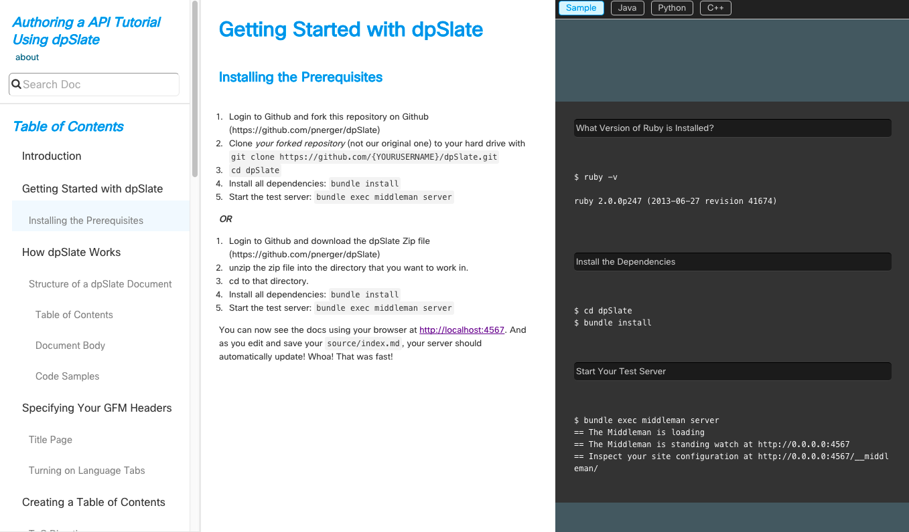

dpSlate
========

dpSlate helps you create beautiful single-page API documentation. Think of it as an intelligent, responsive documentation template for your API. This variation is based upon the Slate work done by Tripit which in turn was inspired by the API documentation by Stripe.



[View the live, interactive document now!](build/index.html)

Features
------------

* **Clean, intuitive design** — with dpSlate, the description of your API is on the left side of your documentation, and all the code examples are on the right side. Inspired by [Stripe's](https://stripe.com/docs/api) API docs. In addition to the design you see on screen, dpSlate comes with a print stylesheet, so your API docs look great on paper.

* **Everything on a single page** — gone are the days where your users had to search through a million pages to find what they wanted. Slate puts the entire documentation on a single page. We haven't sacrificed linkability, though. As you scroll, your browser's hash will update to the nearest header, so linking to a particular point in the documentation is still natural and easy.

* **Optional Two Column Layout** - would you rather have your code samples inline with the content?  With a simple directive you can change the layout such that you get what you want.

* **Slate is just Markdown** — when you write docs with Slate, you're just writing Markdown, which makes it simple to edit and understand. Everything is written in Markdown — even the code samples are just Markdown code blocks!

* **Write code samples in multiple languages** — if your API has bindings in multiple programming languages, you easily put in tabs to switch between them. In your document, you'll distinguish different languages by specifying the language name at the top of each code block, just like with Github Flavored Markdown!

* **Out-of-the-box syntax highlighting** for [almost 60 languages](http://rouge.jayferd.us/demo), no configuration required.

* **Title Page** The title of the document is displayed at the very top (but not in the Table of Contents).  Below this is a small _about_ button, when you press this the full Title Page is displayed.  Title Page data comes from the directives that you place in your Markdown file plus the date of publication is automatically calculated based upon when you built the document.

* **Document Search** above the table of contents, is a search box that performs search of the entire document.  It will tell you how many hits you had and provide a _next_ and _prev_ button to walk you through the results.

* **Automatic, smoothly scrolling table of contents** on the far left of the page. As you scroll, it displays your current position in the document. It's fast, too. We're using Slate at TripIt to build documentation for our new API, where our table of contents has over 180 entries. We've made sure that the performance remains excellent, even for larger documents.

Getting starting with dpSlate is super easy! Simply fork this repository, and then follow the instructions below. Or, if you'd like to check out what Slate is capable of, take a look at the [Authoring a API Tutorial Using dpSlate] (build/index.html)

Getting Started with Slate
------------------------------

### Prerequisites

You're going to need:

 - **Linux or OS X** — Windows will probably work, but is unsupported.
 - **Ruby, version 1.9.3 or newer**
 - **Bundler** — If Ruby is already installed, but the `bundle` command doesn't work, just run `gem install bundler` in a terminal.

### Getting Set Up

 1. Fork this repository on Github.
 2. Clone *your forked repository* (not our original one) to your hard drive with `git clone https://github.com/YOURUSERNAME/dpSlate.git`
 3. `cd dpSlate`
 4. Install all dependencies: `bundle install`
 5. Start the test server: `bundle exec middleman server`

Or use the included Dockerfile! (must install Docker first)

```shell
docker build -t slate .
docker run -d -p 4567:4567 --name slate -v $(pwd)/source:/app/source slate
```

You can now see the docs at <http://localhost:4567>. Whoa! That was fast!

*Note: if you're using the Docker setup on OSX, the docs will be availalable at the output of `boot2docker ip` instead of `localhost:4567`.*

Now that Slate is all set up your machine, you'll probably want to learn more about [editing Slate markdown](https://github.com/tripit/slate/wiki/Markdown-Syntax), or [how to publish your docs](https://github.com/tripit/slate/wiki/Deploying-Slate).


Learn How to Create a dpSlate API Document
---------------------------------

Contributors
--------------------

dpSlate was forked from TripIt slate and enhanced by Paul Nerger of [DeveloperProgram.com] (http://www.developerprogram.com).

Thanks to the following people who have submitted major pull requests to TripIt Slate:

- [Robert Lord](https://lord.io) who built the original Slate while at [TripIt](http://tripit.com).
- [@chrissrogers](https://github.com/chrissrogers)
- [@bootstraponline](https://github.com/bootstraponline)
- [@realityking](https://github.com/realityking)

Special Thanks
--------------------
- [Tripit Slate](https://github.com/tripit/slate)
- [Middleman](https://github.com/middleman/middleman)
- [jquery.tocify.js](https://github.com/gfranko/jquery.tocify.js)
- [middleman-syntax](https://github.com/middleman/middleman-syntax)
- [middleman-gh-pages](https://github.com/neo/middleman-gh-pages)
- [Font Awesome](http://fortawesome.github.io/Font-Awesome/)
- [@chrissrogers](https://github.com/chrissrogers)
- [@bootstraponline](https://github.com/bootstraponline)
- [Cisco DevNet](https://developer.cisco.com) who use dpSlate in the great work that they do in supporting Developers.

